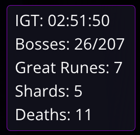

# er-overlay

This is an in-game overlay for ELDEN RING with the ability to track the following data:

1. Bosses Killed
2. Total Bosses being tracked
3. Number of player deaths
4. Number of Messmer's Kindling Shards in player's inventory
  - This is compatible with Matt's Randomizer (it has custom logic that splits Kindling into shards required burn the sealing tree)
5. Number of Great Runes player has acquired

## How to Use

Visit the [releases](https://github.com/ignitesouls/er-overlay/releases/latest) page. Download and extract the latest release. Include into your modded ELDEN RING game by using modengine3 (recommended) or by using "Add dll mod" in Matt's Item and Enemy Randomizer.

## Changing the overlay display text
Edit the `ignite_overlay_config.toml` file, navigate to this section:
```toml
[overlay]
# how to display the text on the overlay
# display text = "IGT: {igt}$nBosses: {kills}/{total}$nGreat Runes: {runes}$nShards: {shards}$nDeaths: {deaths}"
#  $n = newline
#  {kills} = current kill count
#  {total} = total boss count
#  {deaths}= Death count in current game
#  {igt}   = In-game time
#  {shards}= Number of messmer's kindling shards acquired
#  {runes} = Number of great runes acquired
display_text = "IGT: {igt}$nBosses: {kills}/{total}$nGreat Runes: {runes}$nShards: {shards}$nDeaths: {deaths}"
```
This translates into the overlay displaying:



## Contributing

Want to help shape the overlay? Join the [Ignite discord](https://discord.gg/ignitesouls) and contact a @firekeeper to learn more about our mod team.

---

### Credits
- [Sully-](https://github.com/Sully-): for showing me hudhook, sharing code examples, and helping me with debugging the overlay
- [hudhook](https://github.com/veeenu/hudhook): a rust crate for creating in-game UI overlays, made by Andrea
- [fromsoftware-rs](https://github.com/vswarte/fromsoftware-rs): a collection of rust crates for interacting with elden ring specifically, made by Vswarte

## Licensing

SPDX-License-Identifier: GPL-3.0-only